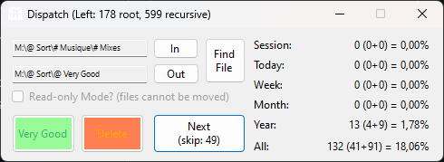

# FilesDispatcher

A simple "Keep or Delete files" app that can open files at random in a given folder, and lets you keep or deleting them on the spot.

Also displays useful progress statistics:

## Changelog

* 2026.02.21 = added Github worflow
* 2024.10.23 = fixed Start button label not updating on first execution
* 2024.02.09 = refactored Engine to prevent excessive I/O reads (full recursive browsing throttled every n days instead of per Windows restart/cache refresh)
* 2023.11.05 = fixed some files that couldn't be opened because of Unicode chars in their names (by using Windows shell instead of explorer.exe in ProcessStartInfo)
* 2023.09.15 = fixed random off by one (prevented last file from ever being picked)
* 2023.03.31 = adapted stats loading lifecycle: 'Stats' folder only created when not read-only (otherwise best effort aka load available counts)
* 2023.02.17 = fixed missing AllCount initialization causing null ref in Engine contructor
* 2023.01.22
  * read-only mode disable Move buttons
  * 'All-time' stats (scan Stats folder, loop past years)
  * Make window stay on top (TopMost property)
* 2022.10.05 = added Jump() immediate volume control method
* 2022.09.23
  * Main window controls colour
  * set Volume
  * get CurrentFileName
* 2022.08.14
  * added a .NET Core 6.0 WebAPI
    * [.NET 6.0](https://dotnet.microsoft.com/en-us/download/dotnet/6.0) requires Visual Studio 2022, because [Visual Studio 2019 does not support it](https://github.com/AvaloniaUI/Avalonia/discussions/7025) (except using preview SDK option)
  * manually edited the WebAPI's _.csproj_ to target `net6.0-windows` instead of default `net6.0` to fix compatibility issues
  * see [Target frameworks in SDK-style projects](https://docs.microsoft.com/en-us/dotnet/standard/frameworks)

## TODO

* Read-only
  * Prevent all keyboard Move/Delete as well
* Recursive browsing
* Display file title somewhere
